---
## Front matter
title: "Лабораторная работа №8"
subtitle: "Текстовой редактор vi"
author: "Галанова Дарья Александровна "

## Generic otions
lang: ru-RU
toc-title: "Содержание"

## Bibliography
bibliography: bib/cite.bib
csl: pandoc/csl/gost-r-7-0-5-2008-numeric.csl

## Pdf output format
toc: true # Table of contents
toc-depth: 2
lof: true # List of figures
lot: true # List of tables
fontsize: 12pt
linestretch: 1.5
papersize: a4
documentclass: scrreprt
## I18n polyglossia
polyglossia-lang:
  name: russian
  options:
	- spelling=modern
	- babelshorthands=true
polyglossia-otherlangs:
  name: english
## I18n babel
babel-lang: russian
babel-otherlangs: english
## Fonts
mainfont: PT Serif
romanfont: PT Serif
sansfont: PT Sans
monofont: PT Mono
mainfontoptions: Ligatures=TeX
romanfontoptions: Ligatures=TeX
sansfontoptions: Ligatures=TeX,Scale=MatchLowercase
monofontoptions: Scale=MatchLowercase,Scale=0.9
## Biblatex
biblatex: true
biblio-style: "gost-numeric"
biblatexoptions:
  - parentracker=true
  - backend=biber
  - hyperref=auto
  - language=auto
  - autolang=other*
  - citestyle=gost-numeric
## Pandoc-crossref LaTeX customization
figureTitle: "Рис."
tableTitle: "Таблица"
listingTitle: "Листинг"
lofTitle: "Список иллюстраций"
lotTitle: "Список таблиц"
lolTitle: "Листинги"
## Misc options
indent: true
header-includes:
  - \usepackage{indentfirst}
  - \usepackage{float} # keep figures where there are in the text
  - \floatplacement{figure}{H} # keep figures where there are in the text
---

# Цель работы

Познакомиться с операционной системой Linux. Получить практические навыки работы с редактором vi, установленным по умолчанию практически во всех дистрибутивах.

# Задание

Сделать отчёт по лабораторной работе №9 в формате Markdown.
Познакомиться с операционной системой Linux.

# Выполнение лабораторной работы
# 1 задание 
1) Создаю  каталог с именем ~/work/os/lab06, перехожу во вновь созданный каталог (рис. [-@fig:001])

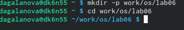{ #fig:001 width=70% }

2)Вызоваю  vi и создаю файл hello.sh  (рис. [-@fig:002])

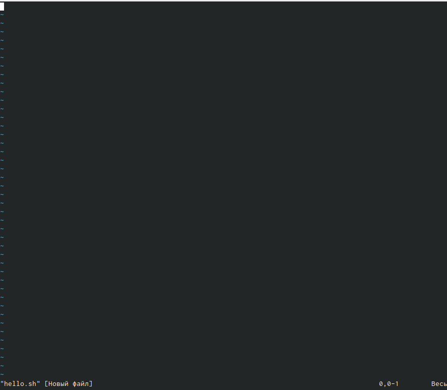{ #fig:002 width=70% }

3) Нажмаю клавишу i и вводите следующий текст  (рис. [-@fig:003])

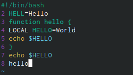{ #fig:003 width=70% }

4) Нажмаю клавишу Esc для перехода в командный режим после завершения ввода
текста, для перехода в режим последней строки и внизу вашего экрана появится
приглашение в виде двоеточия, нажмаю  w (записать) и q (выйти), а затем нажмите клавишу Enter для сохранения
моего текста и завершения работы.  (рис. [-@fig:004])

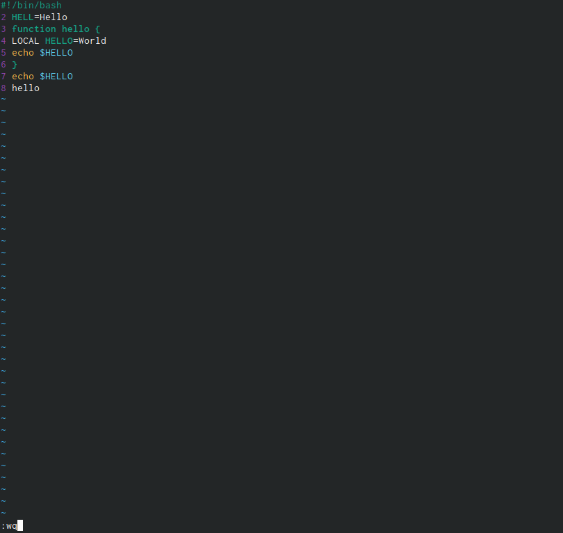{ #fig:004 width=70% }

5)делаю  файл исполняемым (рис. [-@fig:005])

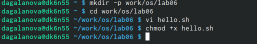{ #fig:005 width=70% } 

# 2 задание 

1) Вызову vi на редактирование файла
 vi ~/work/os/lab06/hello.sh
 Установлю курсор в конец слова HELL второй строки (рис. [-@fig:006])

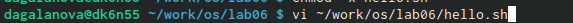{ #fig:006 width=70% } 

2) Перешла в режим вставки, нажав на клавишу «i», и заменила HELL на HELLO, дописав O. Нажала «esc» для возврата в командный режим  (рис. [-@fig:007])

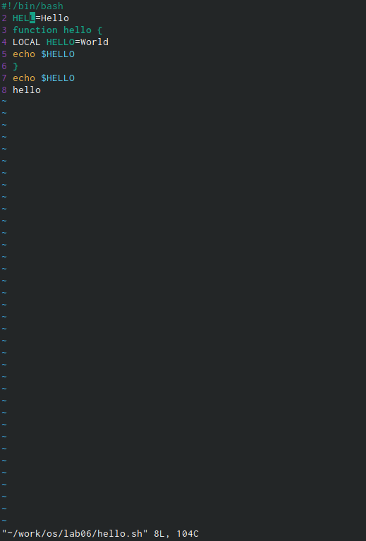{ #fig:007 width=70% } 

3) С помощью стрелок установила курсор на четвертую строку и стёрла слово LOCAL с помощью комбинации клавиш «d» (delete) и «w» (word)  (рис. [-@fig:008])

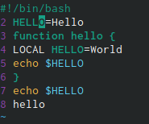{ #fig:008 width=70% } 

4) Установливаю  курсор на последней строке файла. Вставляю после неё строку, содержащую
следующий текст: echo $HELLO.Нажмаю  Esc для перехода в командный режим. (рис. [-@fig:009])

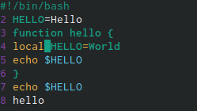{ #fig:009 width=70% } 

5) Ввела команду отмены изменений «u» для отмены последней команды  (рис. [-@fig:0010])

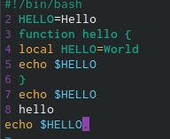{ #fig:0010 width=70% } 

6) Ввела символ «:» для перехода в режим последней строки. Записала произведённые изменения, нажав «w» и «q» и вышла из vi (рис. [-@fig:0011])

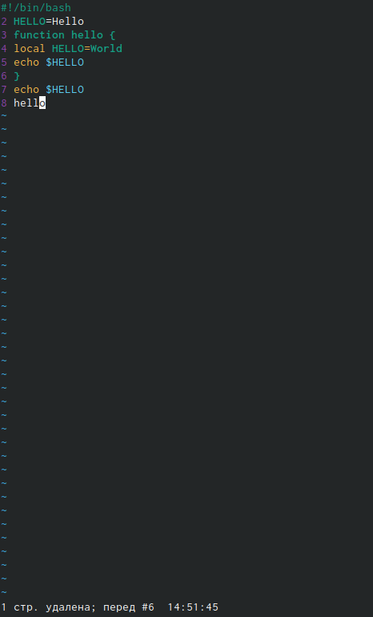{ #fig:0011 width=70% } 

# Ответы на контрольные вопросы:
1). Редактор vi имеет три режима работы:

командный режим − предназначен для ввода команд редактирования и навигации по редактируемому файлу;

режим вставки − предназначен для ввода содержания редактируемого файла;

режим последней (или командной) строки − используется для записи изменений в файл и выхода из редактора.

2). Чтобы выйти из редактора, не сохраняя произведённые изменения, нужно в режиме командной строки нажать клавиши «:» «q» «!»

3). Команды позиционирования:

«0»(ноль) − переход в начало строки;

«$» − переход в конец строки;

«G» − переход в конец файла;

n«G» − переход на строку с номером n.

4). При использовании прописных W и B под разделителями понимаются только пробел, табуляция и возврат каретки. При использовании строчных w и b под разделителями понимаются также любые знаки пунктуации.

5). Чтобы из любого места редактируемого файла перейти в начало (конец) файла, нужно в режиме командной строки нажать клавиши «1» «G» («G»).

6). Команды редактирования:

Вставка текста
«а» − вставить текст после курсора;

«А» − вставить текст в конец строки;

«i» − вставить текст перед курсором;

n «i» − вставить текст n раз;

«I» − вставить текст в начало строки.

Вставка строки
«о» − вставить строку под курсором;

«О» − вставить строку над курсором.

Удаление текста
«x» − удалить один символ в буфер;

«d» «w» − удалить одно слово в буфер;

«d» «$» − удалить в буфер текст от курсора до конца строки;

«d» «0» − удалить в буфер текст от начала строки до позиции курсора;

«d» «d» − удалить в буфер одну строку;

n «d» «d» − удалить в буфер n строк.

Отмена и повтор произведённых изменений
«u» − отменить последнее изменение;

«.» − повторить последнее изменение.

Копирование текста в буфер
«Y» − скопировать строку в буфер;

n «Y» − скопировать n строк в буфер;

«y» «w» − скопировать слово в буфер.

Вставка текста из буфера
«p» − вставить текст из буфера после курсора;

«P» − вставить текст из буфера перед курсором.

Замена текста
«c» «w» − заменить слово;

n «c» «w» − заменить nслов;

«c» «$» − заменить текст от курсора до конца строки;

«r» − заменить слово;

«R» − заменить текст.

Поиск текста
«/» текст − произвести поиск вперёд по тексту указанной строки символов текст;

«?» текст − произвести поиск назад по тексту указанной строки символов текст.

Копирование и перемещение текста
«:» n,m «d» – удалить строки с n по m;

«:» i,j «m» k – переместить строки с i по j, начиная со строки k;

«:» i,j «t» k – копировать строки с i по j в строку k;

«:» i,j «w» имя-файла – записать строки с i по j в файл с именем имя-файла.

7). Чтобы заполнить строку символами $, необходимо для начала перейти на эту строку, нажав клавиши n «G», где n – номер строки, далее нажать «0» для перехода в начало строки. Теперь необходимо нажать «c» «$», чтобы заменить текст от курсора до конца строки, и ввести символы $.

8). Чтобы отменить по одному предыдущему действию последовательно, необходимо нажать «u». Чтобы отменить все изменения, произведённые со времени последней записи, нужно нажать «:» «e» «!».

9). Команды редактирования в режиме командной строки

Копирование и перемещение текста
«:»n,m «d» − удалить строки с n по m;

«:»i,j «m» k − переместить строки с i по j, начиная со строки k;

«:»i,j «t» k − копировать строки с i по j в строку k;

«:»i,j «w» имя-файла − записать строки с i по j в файл с именем имя-файла.

Запись в файл и выход из редактора
«:» «w» − записать изменённый текст в файл, не выходя из vi;

«:» «w» имя-файла − записать изменённый текст в новый файл с именем имя-файла;

«:» «w» «!» имя-файла − записать изменённый текст в файл с именем имя-файла;

«:» «w» «q» − записать изменения в файл и выйти из vi;

«:» «q» − выйти из редактора vi;

«:» «q» «!» − выйти из редактора без записи;

«:» «e» «!» − вернуться в командный режим, отменив все изменения, произведённые со времени последней записи.

Опции
Опции редактора vi позволяют настроить рабочую среду. Для задания опций используется команда set (в режиме последней строки):

«:»set all − вывести полный список опций;

«:»set nu − вывести номера строк;

«:»set list − вывести невидимые символы;

«:»set ic − не учитывать при поиске, является ли символ прописным или строчным.

Если вы хотите отказаться от использования опции, то в команде set перед именем опции надо поставить no.

10). Чтобы определить, не перемещая курсора, позицию, в которой заканчивается строка, нужно в командном режиме находясь на нужной строке нажать «$»и посмотреть на число после запятой в правом нижнем углу экрана 

11). Опции редактора vi позволяют настроить рабочую среду. Для задания опций используется команда set (в режиме командной строки). Если вы хотите отказаться от использования опции, то в команде set перед именем опции надо поставить no. Чтобы просмотреть опции редактора vi, необходимо нажать «:» set all . Нажав «:» help “название_опции”, можно узнать назначение конкретной опции. 

12). В режиме командной строки внизу редактора присутствует «:», в режиме ввода – «--ВСТАВКА --», в командном режиме внизу ничего нет.

# Выводы

я познакомилась с операционной системой Linux, получила практические навыки работы с редактором vi, установленным по умолчанию практически во всех дистрибутивах.

# Список литературы{.unnumbered}

::: {#refs}
:::
