---
## Front matter
title: "Лабораторная работа №4"
subtitle: "Основы интерфейса взаимодействия пользователя с системой Unix на уровне командной строки"
author: "Галанова Дарья Александровна"

## Generic otions
lang: ru-RU
toc-title: "Содержание"

## Bibliography
bibliography: bib/cite.bib
csl: pandoc/csl/gost-r-7-0-5-2008-numeric.csl

## Pdf output format
toc: true # Table of contents
toc-depth: 2
lof: true # List of figures
lot: true # List of tables
fontsize: 12pt
linestretch: 1.5
papersize: a4
documentclass: scrreprt
## I18n polyglossia
polyglossia-lang:
  name: russian
  options:
	- spelling=modern
	- babelshorthands=true
polyglossia-otherlangs:
  name: english
## I18n babel
babel-lang: russian
babel-otherlangs: english
## Fonts
mainfont: PT Serif
romanfont: PT Serif
sansfont: PT Sans
monofont: PT Mono
mainfontoptions: Ligatures=TeX
romanfontoptions: Ligatures=TeX
sansfontoptions: Ligatures=TeX,Scale=MatchLowercase
monofontoptions: Scale=MatchLowercase,Scale=0.9
## Biblatex
biblatex: true
biblio-style: "gost-numeric"
biblatexoptions:
  - parentracker=true
  - backend=biber
  - hyperref=auto
  - language=auto
  - autolang=other*
  - citestyle=gost-numeric
## Pandoc-crossref LaTeX customization
figureTitle: "Рис."
tableTitle: "Таблица"
listingTitle: "Листинг"
lofTitle: "Список иллюстраций"
lotTitle: "Список таблиц"
lolTitle: "Листинги"
## Misc options
indent: true
header-includes:
  - \usepackage{indentfirst}
  - \usepackage{float} # keep figures where there are in the text
  - \floatplacement{figure}{H} # keep figures where there are in the text
---

# Цель работы

Приобретение практических навыков взаимодействия пользователя с системой посредством командной строки.

# Задание

Изучение команд в Linux

# Выполнение лабораторной работы
1. Определяю полное имя моего домашнего каталога. Перехожу в каталог /tmp и вывожу командой ls сожержимое. Так же выясняю какие ещё комбинация бывают с ls, и чем они отличаются друг от друга. 
 (рис. [-@fig:001])
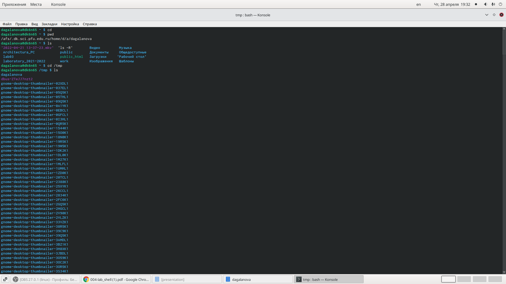{ #fig:001 width=70% }

a)Для просмотра списка всех файлов, включая скрытые файлы и каталоги, вы можете добавить флаг -a (рис. [-@fig:002])(рис. [-@fig:003])

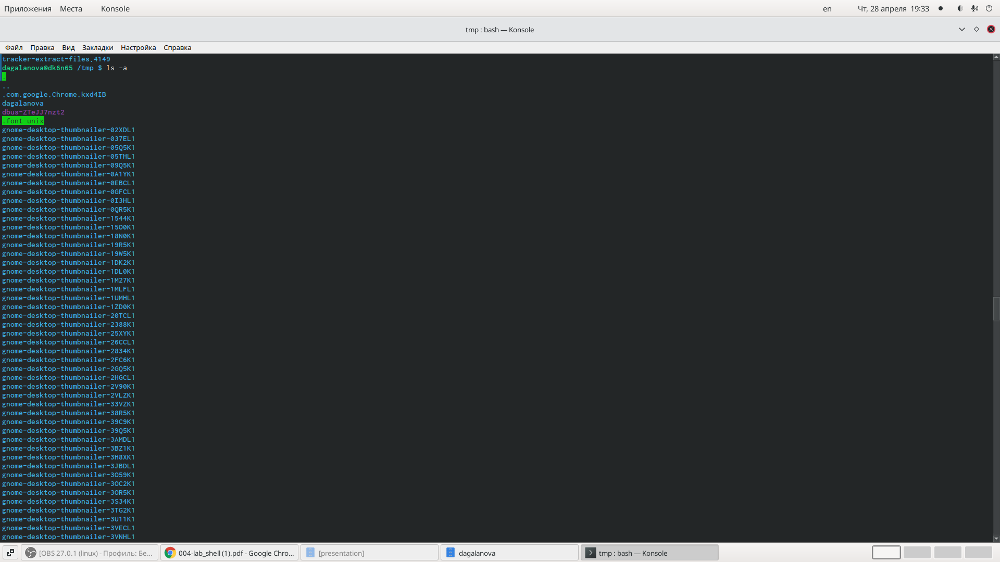{ #fig:002 width=70% }

(рис. [-@fig:003])
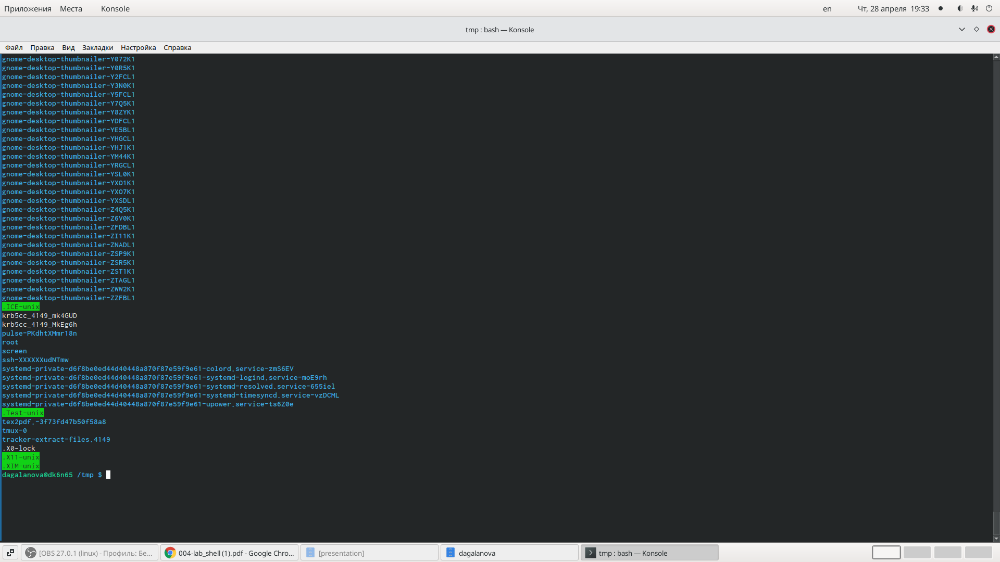{ #fig:003 width=70% }

Б)Отобразить содержимое текущей директории с добавлением к именам символов, характеризующих тип, можно с помощью команды ls -F (рис. [-@fig:004])

 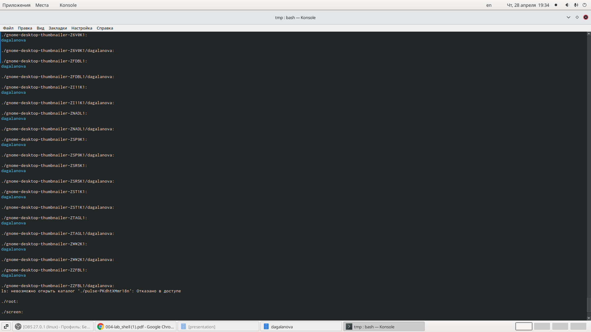{ #fig:004 width=70% }

в)ls - lh  отображает размеры файлов  в формате для чтения (рис. [-@fig:005])

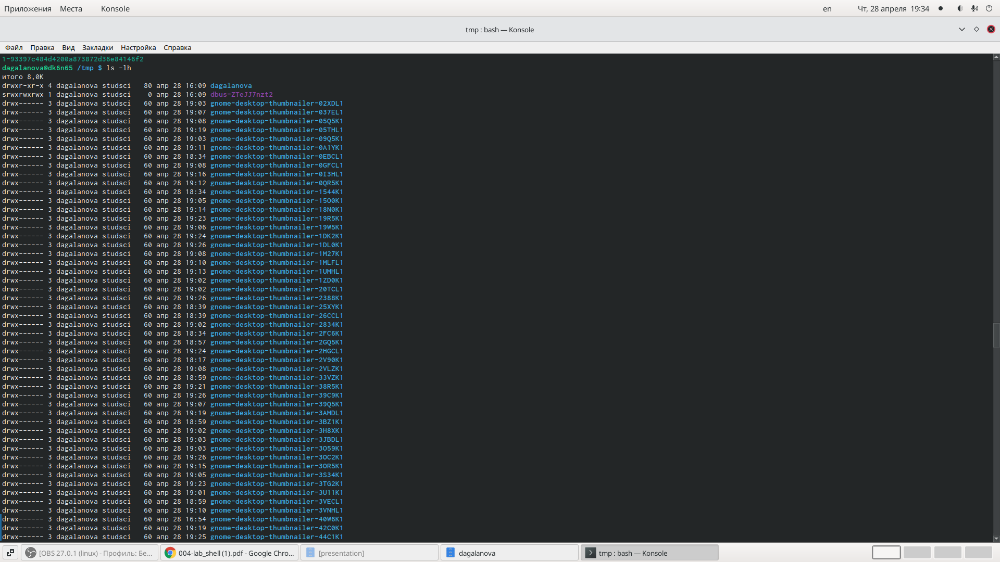{ #fig:001 width=70% }

г)ls -lt перечисляет и отсирует по времени модификации.(рис. [-@fig:006])

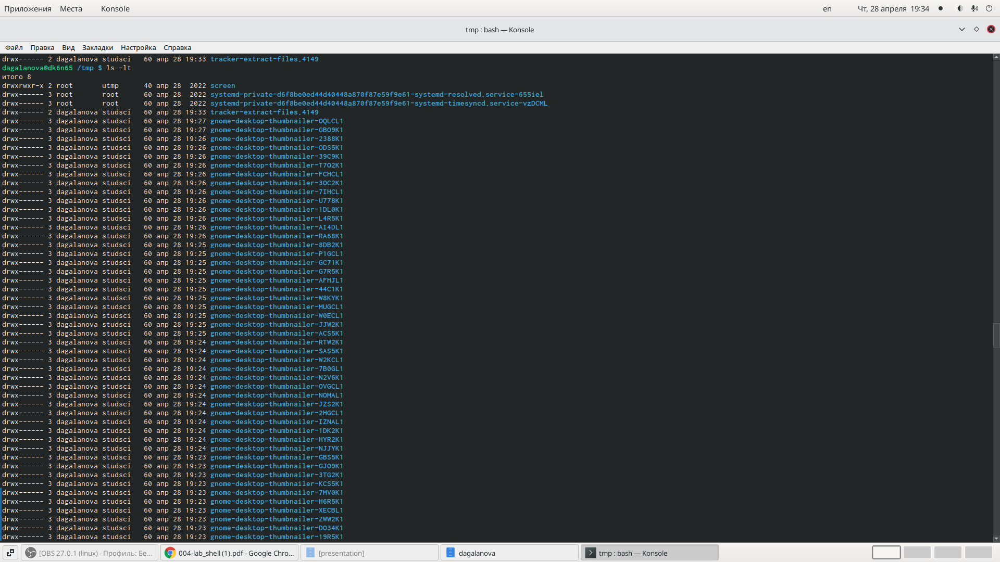{ #fig:006 width=70% }

д)ls / перечисляет содержимое корневого каталога.  ls ../ перечисляет содердимое родительского каталога  (рис. [-@fig:007])

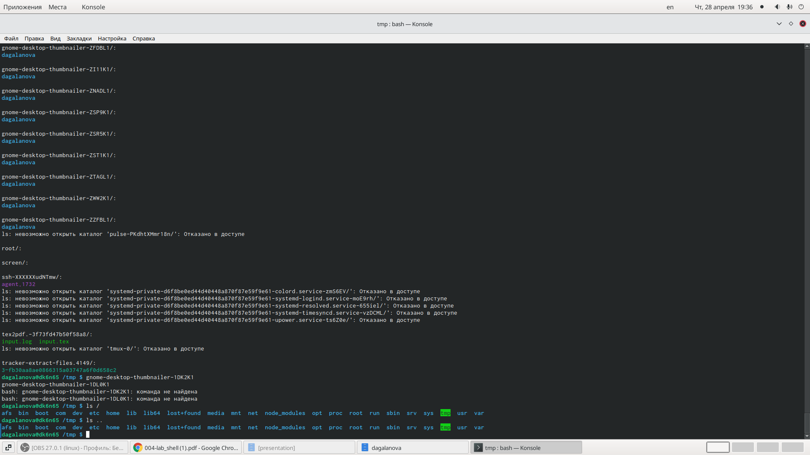{ #fig:007 width=70% }

2. Определяем, есть ли в каталоге /var/spool подкаталог с именем cron?(рис. [-@fig:008])

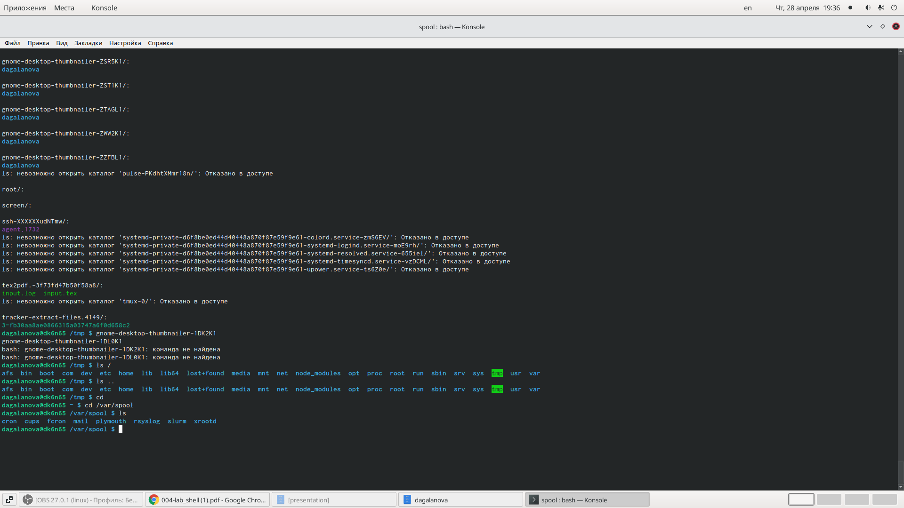{ #fig:008 width=70% }

3. В домашнем каталоге создаём новый каталог с именем newdir.В каталоге ~/newdir создаём новый каталог с именем morefun. В домашнем каталоге создаём одной командой три новых каталога с именами
letters, memos, misk. Затем удаляем эти каталоги одной командой.
 Попробуем  удалить ранее созданный каталог ~/newdir командой rm. Но как мы видем у нас не удалился каталог. Поэтому удаляем каталог с помощью rm -r/ . Проверяем удалился ли наш каталог - да.(рис. [-@fig:009])
 
 { #fig:009 width=70% }
 
 4. С помощью команды man определием набор опций команды ls, позволяющий отсортировать по времени последнего изменения выводимый список содержимого каталога
с развёрнутым описанием файлов.(рис. [-@fig:0010])

 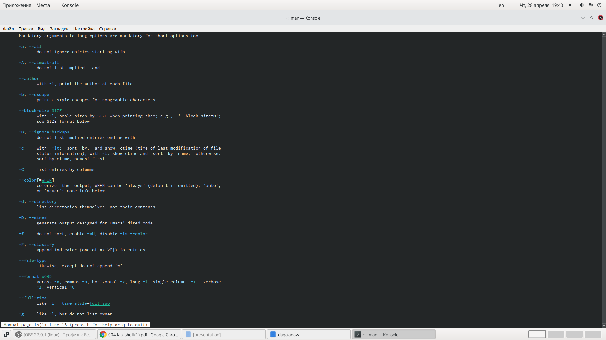{ #fig:0010 width=70% }
 
 5. Используйте команду man для просмотра описания следующих команд: cd, pwd, mkdir,
rmdir, rm. Поясните основные опции этих команд.(рис. [-@fig:0011])
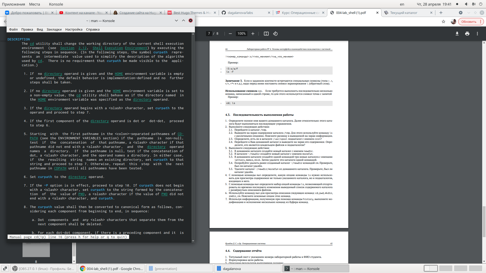{ #fig:0010 width=70% }

(рис. [-@fig:0012])
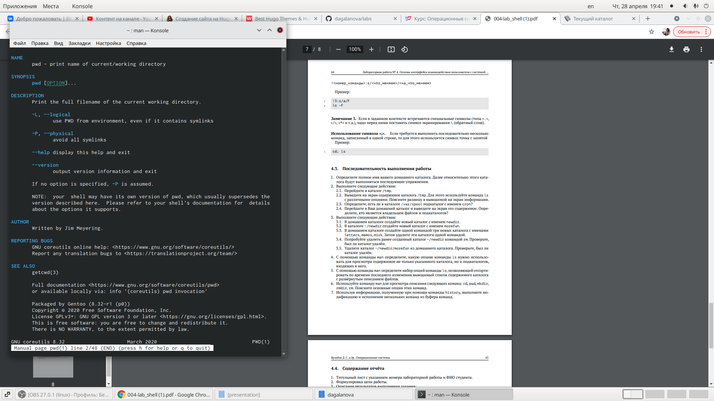{ #fig:0010 width=70% }

(рис. [-@fig:0013])
{ #fig:0010 width=70% }

(рис. [-@fig:0014])
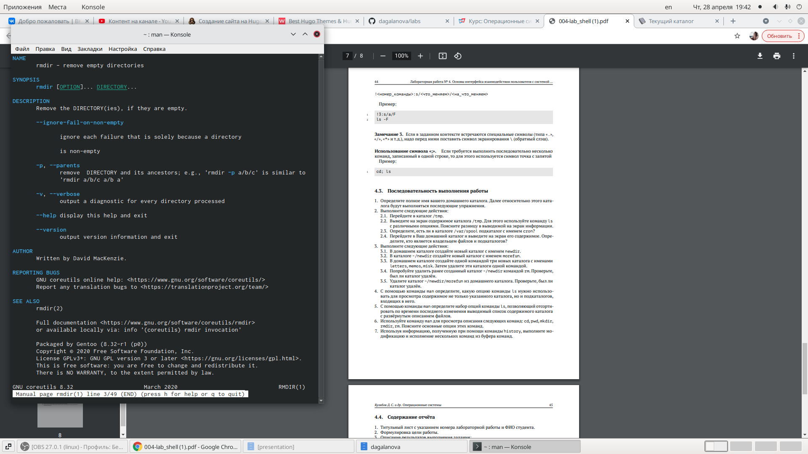{ #fig:0010 width=70% }

(рис. [-@fig:0015])
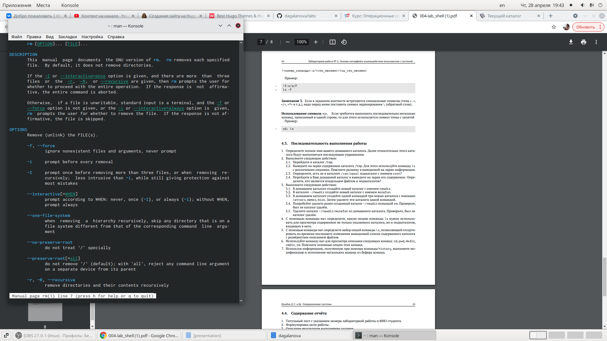{ #fig:0010 width=70% }

6. Используя информацию, полученную при помощи команды history, выполните модификацию и исполнение нескольких команд из буфера команд.(рис. [-@fig:0016])

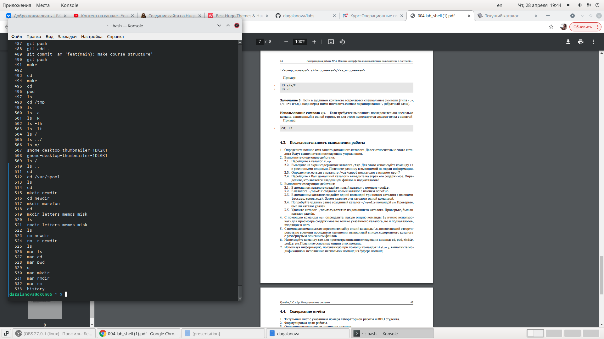{ #fig:0016 width=70% }

# Выводы

Я преобрела  практические навыки взаимодействия пользователя с системой посредством командной строки.

# Список литературы{.unnumbered}

::: {#refs}
:::
