---
## Front matter
title: "Индивидуальный проект "
subtitle: "1 этап"
author: "Галанова Дарья "

## Generic otions
lang: ru-RU
toc-title: "Содержание"

## Bibliography
bibliography: bib/cite.bib
csl: pandoc/csl/gost-r-7-0-5-2008-numeric.csl

## Pdf output format
toc: true # Table of contents
toc-depth: 2
lof: true # List of figures
lot: true # List of tables
fontsize: 12pt
linestretch: 1.5
papersize: a4
documentclass: scrreprt
## I18n polyglossia
polyglossia-lang:
  name: russian
  options:
	- spelling=modern
	- babelshorthands=true
polyglossia-otherlangs:
  name: english
## I18n babel
babel-lang: russian
babel-otherlangs: english
## Fonts
mainfont: PT Serif
romanfont: PT Serif
sansfont: PT Sans
monofont: PT Mono
mainfontoptions: Ligatures=TeX
romanfontoptions: Ligatures=TeX
sansfontoptions: Ligatures=TeX,Scale=MatchLowercase
monofontoptions: Scale=MatchLowercase,Scale=0.9
## Biblatex
biblatex: true
biblio-style: "gost-numeric"
biblatexoptions:
  - parentracker=true
  - backend=biber
  - hyperref=auto
  - language=auto
  - autolang=other*
  - citestyle=gost-numeric
## Pandoc-crossref LaTeX customization
figureTitle: "Рис."
tableTitle: "Таблица"
listingTitle: "Листинг"
lofTitle: "Список иллюстраций"
lotTitle: "Список таблиц"
lolTitle: "Листинги"
## Misc options
indent: true
header-includes:
  - \usepackage{indentfirst}
  - \usepackage{float} # keep figures where there are in the text
  - \floatplacement{figure}{H} # keep figures where there are in the text
---

# Цель работы

Размещение на Github pages заготовки для персонального сайта

# Задание

Установить необходимое программное обеспечение.
Скачать шаблон темы сайта.
Разместить его на хостинге git.
Установить параметр для URLs сайта.
Разместить заготовку сайта на Github pages.

# Выполнение лабораторной работы

1. Установка hugo (рис. [-@fig:001])

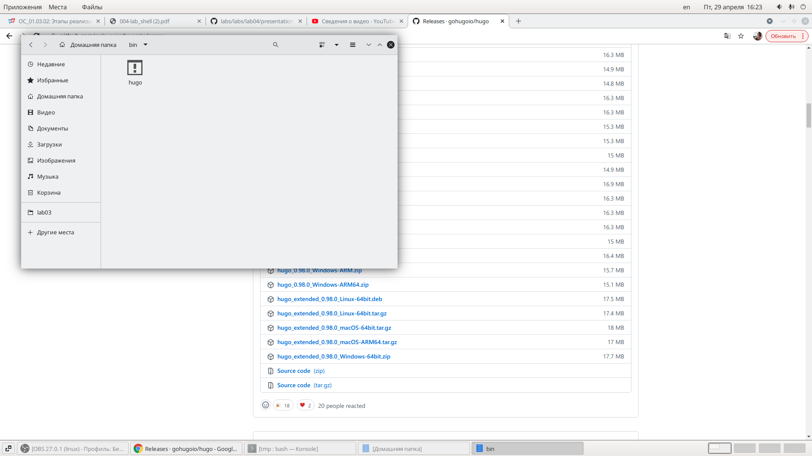{ #fig:001 width=70% }

2. Открываем репозиторий шаблон и копируем ссылку. (рис. [-@fig:002])

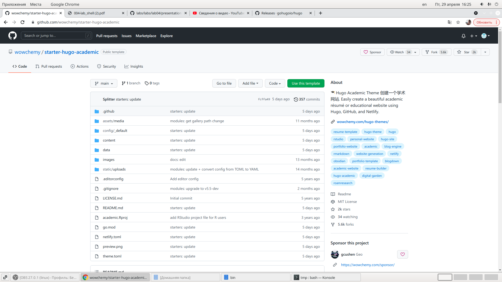{ #fig:002 width=70% }

3. Создание файлов в репозиторий. Проверка файлов. Появление каталога паблик и его удаление. (рис. [-@fig:003])

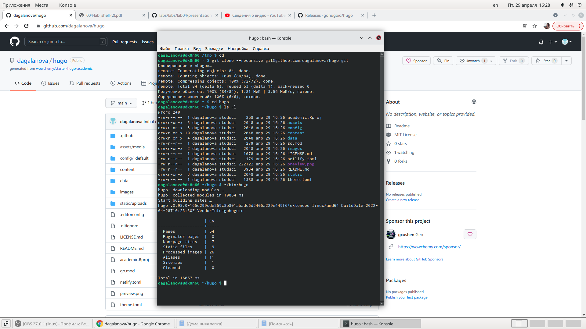{ #fig:003 width=70% }

4. Создание файла(рис. [-@fig:004])

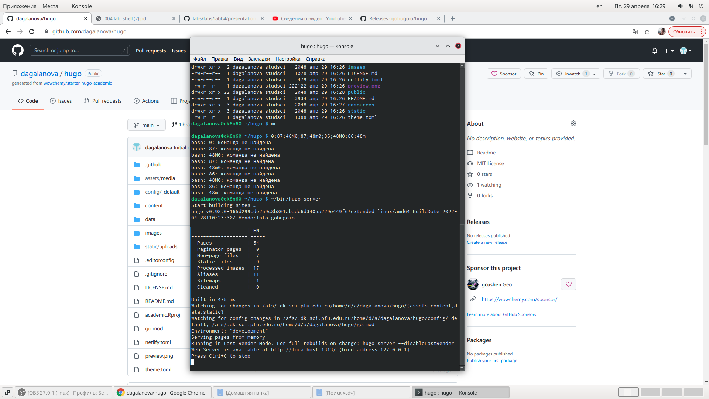{ #fig:004 width=70% }

5. Создание нового репозитория. копируем код и делаем клон на свой компьютерю.Создания новой ветке  main.Создания пустого файла для запуска репозитория. (рис. [-@fig:005])

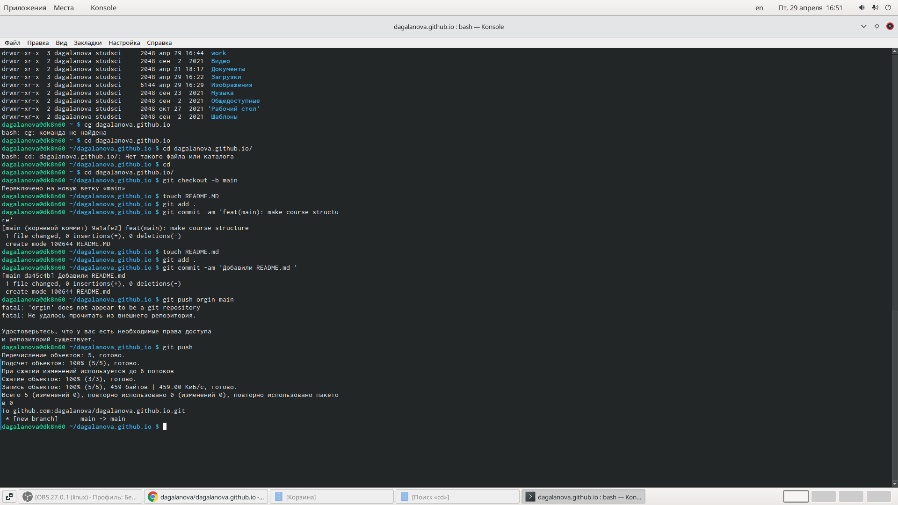{ #fig:005 width=70% }

6. Проверка появления веток, папок, файлов  и т.д  (рис. [-@fig:006])

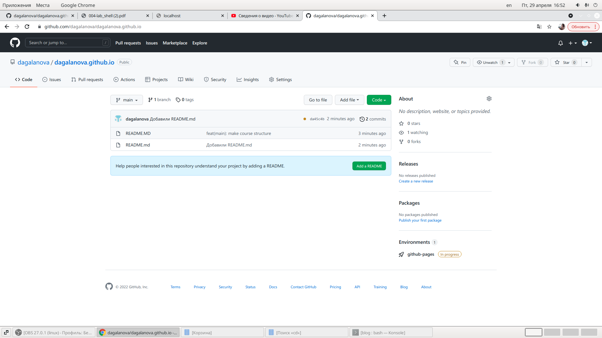{ #fig:006 width=70% }

7. подключаем новый репозиторий к папки  public  для эффективного генерирования сайта. (рис. [-@fig:007])

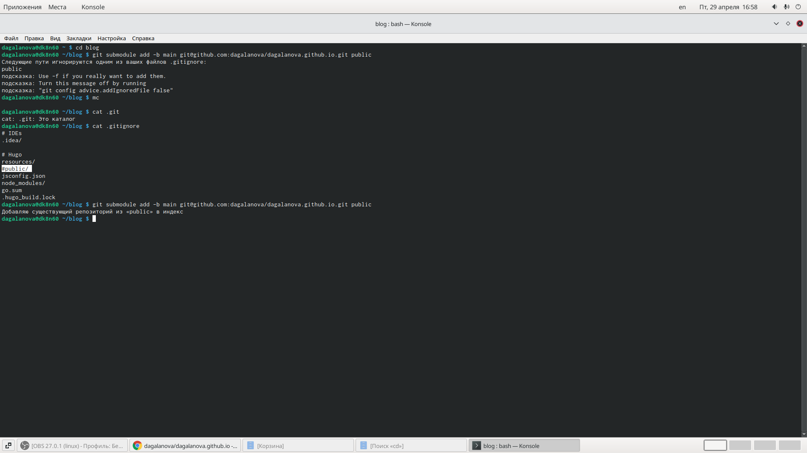{ #fig:007 width=70% }

8. включаем hugo  и видем появление новых файлов в puplic- файлы сайта (рис. [-@fig:008])

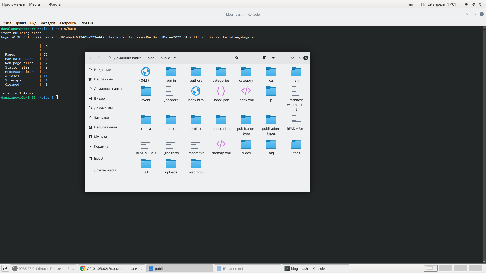{ #fig:008 width=70% }

9. Синхрорнезируем файлы с репозиторием(рис. [-@fig:009])

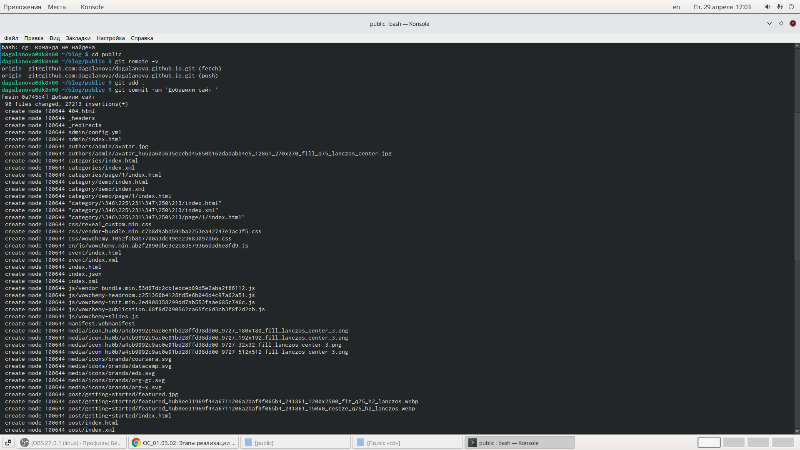{ #fig:009 width=70% }

10. Заходим на сайт, обновляем репозиторий  и смотрим появились ли там папки. (рис. [-@fig:0010])

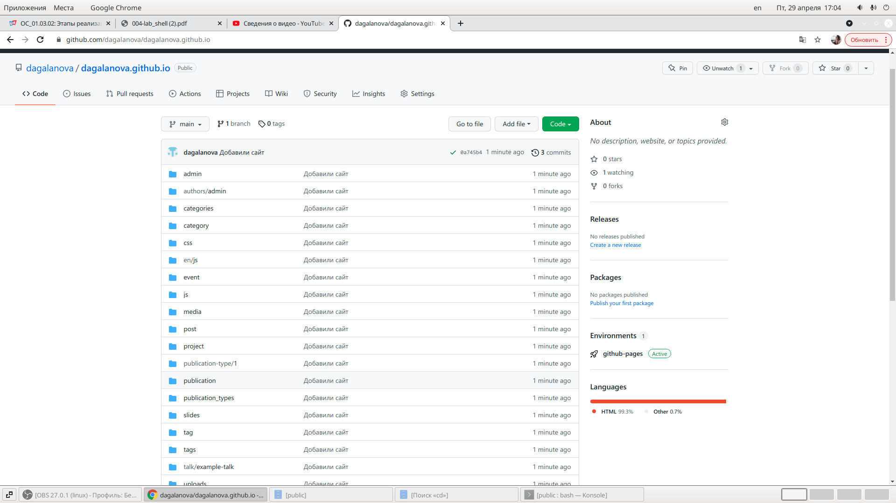{ #fig:0010 width=70% }

11. ссылку сайта загрузаем в интернет и наблюдаем за новым сайтом (рис. [-@fig:0011])

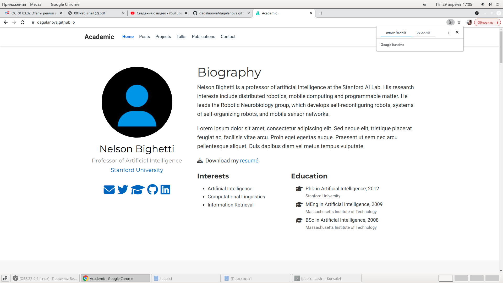{ #fig:0011 width=70% }

# Выводы

Разместила на Github pages заготовки для персонального сайта

# Список литературы{.unnumbered}

::: {#refs}
:::
